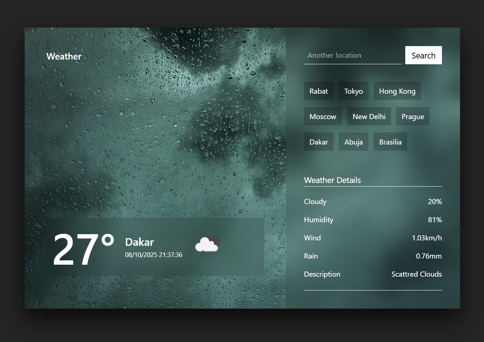

# 🌤️ Weather App

A responsive weather application built with **React**, **Vite**, and **Tailwind CSS**. Users can search for weather information by city or use their current location to get live weather updates.

🔗 [Live Demo on Vercel](https://alx-capstone-project-weather-app.vercel.app/)

---

## 🚀 Features

- **Search weather by city**: Enter a city name to get current weather details.
- **Current location weather**: Automatically fetch weather based on the user's location.
- **Detailed weather information**: Displays temperature, humidity, wind speed, and weather conditions.
- **Dynamic backgrounds**: Background images change based on weather conditions.
- **Responsive design**: Optimized for both desktop and mobile devices.
- **Loading animations**: Provides feedback while fetching data.

---

## 🧪 Technologies Used

- **React** – Frontend framework
- **Vite** – Build tool
- **Tailwind CSS** – Styling framework
- \*\*JavaScript – App logic
- **OpenWeatherMap API** – Weather data
- **BigDataCloud API** – Geolocation

---

## 📸 Screenshots



---

## 🛠️ Getting Started

### Prerequisites

- Node.js (v16+)
- npm or yarn

### Installation

1. Clone the repository:
   ```bash
   git clone https://github.com/Mohamed-Amine-Nafia/alx-weather-app.git
   cd weather-app
   ```

2.Install dependencies:

npm install

# or

yarn

3. Create a .env file in the root directory and add your API keys:

VITE_OPENWEATHER_API_KEY=your_openweathermap_api_key
VITE_LOCATION_TOKEN=your_bigdatacloud_api_key

4. Run the app locally:

npm run dev

# or

yarn dev

The app will be available at http://localhost:5173
